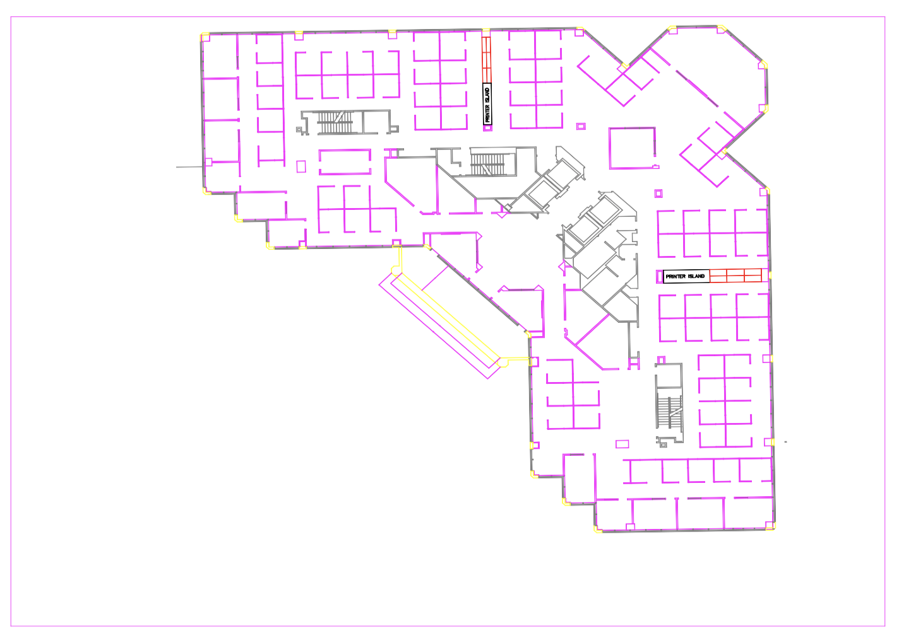

# Dxf Reader and Graph Solver
#### Author: James Dansie

This repo is to read in dxf floor plan, then convert it into a maze/graph that can be solved to find paths through. Currently nodes are placed from the minimum point up until the max point on every increment. It has no special logic to recognize a room or a hall way (big room for improvement).

## Setup
Needs the ezdxf dependency to read images.
To run from the command line;  
```py solve.py ./floorPlans/FloorPlanSample.dxf ./ans/Answer.dxf -m depthfirst```  
This will run a depth first on the FloorPlanSample.dxf file, and will output the answer to the Answer.dxf file. The -m argument is optional. Default is breadth first. Possible choices are; breadthfirst, depthfirst. dijkstra, and astar, are yet to be done. In addition, the user can choose new starting and end points, how often a node is made, and if the answer has the edges/nodes displayed or not.

## Output
These dxf views are from autodesk's free online viewer; viewer.autodesk.com. The sample floor plan looks like this;  
  

The breadth first solution without the nodes and edges looks like this;  
  
Notice the red line for the solution, and the two circles marking the start and end points.

The breadth first solution with the nodes and edges looks like this;  
  

Notice that there are no edges through the walls of the building or the walls of the cubicles.  
  

### Dependencies
* ezdxf - https://pypi.org/project/ezdxf/

### References/Sources
* Mike Pound's original maze solutions; https://github.com/mikepound/mazesolving
https://www.youtube.com/watch?v=rop0W4QDOUI&feature=youtu.be
* SampleFloorPlan.dxf/dwg is just the sample floor plan that comes with autocad 2020.
